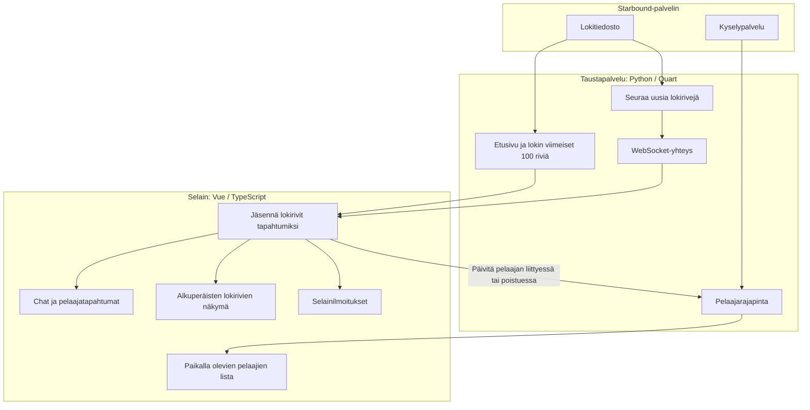

[English](README.md) | [Suomi](README.fi.md)

*Käännös on tehty GPT-5.6:n avustuksella.*

# server_channel_starbound

Selainpohjainen näkymä Starbound-palvelimen tapahtumiin. Näyttää paikalla olevat pelaajat, chat-viestit, pelaajien liittymiset ja poistumiset sekä lokin alkuperäiset rivit. Selainilmoitukset voi ottaa käyttöön erikseen.

Käyttöliittymä on toteutettu Vuella ja TypeScriptillä, taustapalvelu Pythonilla ja Quartilla.

## Keskeiset tiedostot

| Tiedosto | Tarkoitus |
|---|---|
| `src/views/Home.vue` | Kokoaa pelaajalistan ja tapahtumavirran yleisnäkymään. |
| `src/components/EventView.vue` | Näyttää chat-viestit sekä pelaajien liittymiset ja poistumiset. Sisältää painikkeen ilmoitusten käyttöönottoon. |
| `src/store/log.ts` | Tunnistaa lokista tapahtumat ja käynnistää selainilmoitukset. |
| `src/store/player.ts` | Hakee ja päivittää paikalla olevien pelaajien listan. |
| `src/websocket.ts` | Vastaanottaa lokipäivitykset taustapalvelulta reaaliajassa. |
| `lib/starbound_dashboard/watcher.py` | Lukee lokitiedostoa ja odottaa uusia rivejä. |
| `lib/starbound_dashboard/websocket.py` | Lähettää uudet lokirivit yhdistetyille selaimille. |
| `lib/starbound_dashboard/api.py`, `lib/starbound_dashboard/query.py` | Tarjoavat pelaajarajapinnan ja hakevat pelaajalistan pelipalvelimelta. |
| `lib/starbound_dashboard/view.py` | Muodostaa etusivun ja lisää siihen lokin viimeiset 100 riviä. |
| `lib/starbound_dashboard/__main__.py` | Käynnistää taustapalvelun valitussa portissa. |

## Toimintaperiaate



## Asetukset

1. Määritä sovelluksen tietohakemisto ympäristömuuttujalla `STARBOUND_DASHBOARD_STORAGE`. Oletus on `/srv/starbound-dashboard`.

2. Luo tietohakemistoon `etc/config.py` käyttäen [config.py](lib/starbound_dashboard/config.py)-tiedostoa mallina. Määritä pelipalvelimen osoite, kyselyportti ja lokitiedoston polku. Lokin on oltava luettavissa taustapalvelun kontin sisältä.

3. Luo `etc/nginx.conf` käyttäen [nginx.conf](nginx.conf)-tiedostoa mallina. Lisää asetuksissa määritetyt TLS-varmenne, yksityinen avain ja HTTP Basic -tunnistautumisen salasanatiedosto.

4. Mukauta [docker-compose.override.yml](docker-compose.override.yml)-tiedoston porttiohjaukset ja hakemistoliitokset ympäristöösi. Varmista, että taustapalvelun kontti pystyy lukemaan pelipalvelimen lokin ja käyttämään sen kyselypalvelua.

## Käyttöönotto

Ympäristössä tarvitaan Node.js, npm, Docker ja Docker Compose siten, että `docker-compose`-komento on käytettävissä.

Asenna käyttöliittymän riippuvuudet ja käännä käyttöliittymä projektin juurihakemistossa:

```bash
npm install
npm run build
```

Rakenna konttikuvat ja käynnistä palvelut taustalle:

```bash
docker-compose up -d --build
```

Kun palvelut ovat käynnissä, avaa sovellus Nginxin asetuksissa määritetyssä HTTPS-osoitteessa.
