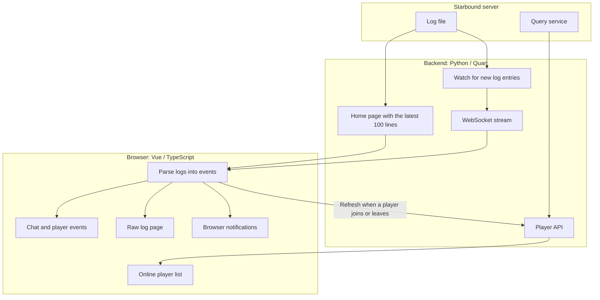

[English](README.md) | [Suomi](README.fi.md)

# server_channel_starbound

A browser-based dashboard for a Starbound server. View online players, chat messages, player join and leave events, and raw logs, with optional browser notifications.

The frontend uses Vue and TypeScript; the backend uses Python and Quart.

## Main files

| File | Purpose |
|---|---|
| `src/views/Home.vue` | Combines the online player list and event feed on the overview page. |
| `src/components/EventView.vue` | Displays chat messages and player join and leave events, with a button to enable notifications. |
| `src/store/log.ts` | Parses logs into events and triggers browser notifications. |
| `src/store/player.ts` | Fetches and updates the online player list. |
| `src/websocket.ts` | Receives live log updates from the backend. |
| `lib/starbound_dashboard/watcher.py` | Reads the log file and waits for new entries. |
| `lib/starbound_dashboard/websocket.py` | Broadcasts new log entries to connected browsers. |
| `lib/starbound_dashboard/api.py`, `lib/starbound_dashboard/query.py` | Provide the player API and query the game server for its player list. |
| `lib/starbound_dashboard/view.py` | Renders the home page with the latest 100 log lines. |
| `lib/starbound_dashboard/__main__.py` | Starts the backend on a configurable port. |

## How it works



## Configuration

1. Set the application data directory using the `STARBOUND_DASHBOARD_STORAGE` environment variable. The default is `/srv/starbound-dashboard`.

2. Use [config.py](lib/starbound_dashboard/config.py) as a reference to create `etc/config.py` in the data directory. Configure the game server address, query port, and log file path. The log path must be accessible from inside the backend container.

3. Use [nginx.conf](nginx.conf) as a reference to create `etc/nginx.conf`. Provide the TLS certificate, private key, and HTTP Basic Authentication file referenced by the configuration.

4. Adjust the port mappings and directory mounts in [docker-compose.override.yml](docker-compose.override.yml) for your environment. Ensure the backend container can read the game server log and access its query service.

## Deployment

The environment requires Node.js, npm, Docker, and Docker Compose with the `docker-compose` command available.

From the project root, install the frontend dependencies and build the frontend:

```bash
npm install
npm run build
```

Build the container images and start the services in the background:

```bash
docker-compose up -d --build
```

Once the services are running, access the dashboard at the HTTPS address configured in Nginx.
